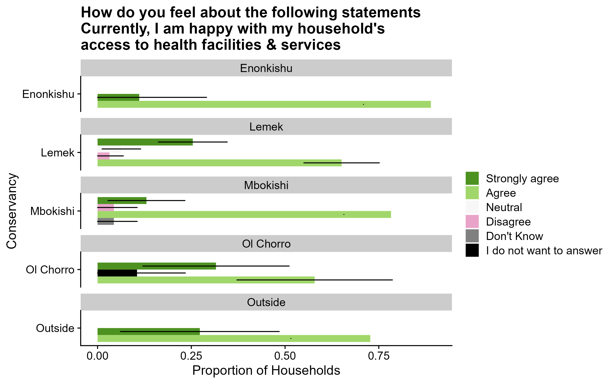

```{r include = FALSE}
knitr::opts_chunk$set(echo = FALSE)
knitr::opts_chunk$set(message = FALSE)
knitr::opts_chunk$set(warning = FALSE)

knitr::opts_chunk$set(
  fig.asp = 12/16,
  fig.align = 'center',
  echo = F,
  out.width = "50%",
  dpi= 300
)

```

```{r libraries}
library(tidyverse)
library(officer)
library(gdtools)
library(webshot)
```


```{r setting functions to produce individual formatted tables}
std_border = fp_border(color="#000000", width = 2)
require("gdtools")
fontname <- "Calibri Light"
```


# Aim and Objective 
This survey was an assessment of the Northern Mara Conservancies that aimed at finding out more about the impacts that the conservancies have had on the livelihoods of the land owners. This was done by monitoring the members’ and non-members’ perspectives of the conservancies in the area. 

This will then  provide key stakeholders with recommendations that they can consistently use to inform the strategies of the conservancies and work with land owners and community members to increase understanding and appreciation of the role of conservancies in the Mara.

---

# Choice of Questions
We developed questions that would help us deduce the respondents well-being before and after establishment of the conservancies. These questions were also translated to Swahili and Maa languages. The questionnaire was then used to create a survey form that was uploaded on ODK Collect, an app that was used by the enumerators in the field to collect data.

# Sample Frame
To construct the sample frame, a list of the land owners from each conservancy was collected and compiled from the community liaisons of each of the conservancies. Landowners living in the conservancies and those living outside totaled 414. Out of this a sample size of 150 households was randomly picked. The sample frame used included all heads of households from each area; the heads of households were defined but were not gender specific. 


An ethics document was developed and translated, it explained what and why we were doing the survey, how the data would be used; that we could not make any guarantee that the interview or research would lead to changes in their life; that access and dissemination of all the information they provided would remain confidential and anonymous; and that they were free to refuse to answer any question, or to terminate the survey at any time, without explanation. The research assistant then had to ask explicitly if they consented to participate, and their answer was recorded. 

---

# Methodology
3 enumerators were recruited to carry out data collection where each enumerator was to interview 50 household heads. Here, a household (olmarei) was defined as a household within the homestead boma (enkang’ ), with its own gate. The household (olmarei) can make decisions about most things independently. The household head (olopeny olmarei) could be a man or woman who had dependents, like one or more wives, children, grandchildren, parents, dependent siblings, and others who lived with the family and depended on them for food. It could also be a woman who looked after herself and her family, or a widow, or any son who does not relying on his father, even if he lived in the same homestead boma (enkang’ ). The household (olmarei) might have had houses (inkajijik ) here, and elsewhere, like in another homestead boma or a town center and it was important to include them in the calculations about the household. An old man could not include in his calculations, his sons who now had their own households (olmarei). The household survey questions were directed at the head of the household (olopeny olmarei). 
Training the enumerators was then scheduled and held on 17th and 18th October 2022. The purpose of the training was to introduce the enumerators to the purpose of the survey, definitions of key terms, help them understand the different components of the survey questionnaire, best practices during data collection, address research ethics, etc. It also involved practice interviews where the enumerators went through a test data collection exercise using the ODK app and phones provided to them and they were also allowed to suggest any amendments prior to actual deployment. 

---

# Data Collection and Validation
The actual data collection in Enonkishu, Lemek, Ol Chorro, Mbokishi, Narok town, and other localities began on 3rd November 2022 and took 3 weeks to be completed. Interviews were conducted mainly at the household head’s homestead and each interview lasted on average 45 minutes. Answers were recorded on the ODK collect app in real time and upon completion, the form was finalized and sent to the server. 
Validation of the data coming in from the enumerators was done on a daily basis through the server and at least 7% of the interviewed respondents were called after the interviews to ask them on how their experience was, how long the enumerators stayed, what kind of questions they were asked and whether they had any questions. Of the total land title holders randomly sampled, a total of 141 submissions were made where 125 respondents (87%) were willing to participate in the interview while 16 (11%) of them refused to participate. 
The data collected will help us to improve our knowledge of the impacts the conservancies have on the land owners and their livelihoods, and the results will help us identify areas that require more attention from the conservancies’ management and the relevant decision-makers. 

---
# Results

In the next slides we discuss the results of the study under the following themes:
1. Governance
2. Well-being

---
# Governance
```{r echo=FALSE, fig.cap= "Who has the authority over THIS conservancy?"}
knitr::include_graphics("images/auth over conservancy.png")
```

---
# Household Influence in the Conservancy
```{r echo=FALSE, fig.cap= "How much influence do you feel the land title holder's household has in decision making in THIS conservancy?"}
knitr::include_graphics("images/inf in conservancy.png")
```

---
# Satisfaction with Accountability
```{r echo=FALSE, fig.cap= "Are you satisfied with the level of accountability in THIS conservancy's decision making?"}
knitr::include_graphics("images/accountability in conservancy.png")
```

---
# Satisfaction with Transparency
```{r echo=FALSE, fig.cap= "Are you satisfied with the transparency of decision making in THIS conservancy?"}
knitr::include_graphics("images/transparency in conservancy.png")
```

---
# Use of Money in the Conservancy 
```{r echo=FALSE, fig.cap= "Do you feel like the land title holder's household is sufficiently informed about the use of the money by the conservancy?"}
knitr::include_graphics("images/Use of Money in the Conservancy.png")
```

---
# Women and Governance 
```{r echo=FALSE, fig.cap= "Do you agree with this statement: Women have the power to influence decisions in this conservancy"}
knitr::include_graphics("images/women have the power.png")
```

---
# Employment Status per Conservancy
```{r echo=FALSE, fig.cap= "Can you please rank the 3 main activities which contribute to the land title holder's household's livelihood at the moment?"}
knitr::include_graphics("images/Leaseholder Occupations.png")
```

---
# Access to education facilities 
```{r echo=FALSE, fig.cap= "Please tell us how you feel about each of the following statements. Currently, I am happy with my household's access to education facilities and services"}
knitr::include_graphics("images/education access.png")
```

---
# Education Levels per conservancy 
```{r echo=FALSE, fig.cap= "What is the highest completed level of education of the land title holder?"}
knitr::include_graphics("images/level of education completed.png")
```

---
# Access to health facilities 
```{r echo=FALSE, fig.cap= "Please tell us how you feel about each of the following statements. Currently, I am happy with my household's access to health facilities and services"}

```

---
# Access to electricity facilities 
```{r echo=FALSE, fig.cap= "Please tell us how you feel about each of the following statements. Currently, I am happy with my household's access to electricity services"}
knitr::include_graphics("images/access_to_electricity.png")
```

---
# Skipping Meals 
```{r echo=FALSE, fig.cap= "Before land access payments were paid by the conservancy, how often did the land title holder's household skip meals due to food shortage? At the moment, how often does the land title holder's household skip meals due to food shortage?"}
knitr::include_graphics("images/skip meals before after.png")
```

---
# Mobility
```{r echo=FALSE, fig.cap= "What is the level of relocating of the land title holder's household to access livestock grazing, but not during a bad drought?"}
knitr::include_graphics("images/level of mobility.png")
```

---
# Growing of Crops 
```{r echo=FALSE, fig.cap= "Has the land title holder's household cultivated crops in the last year, here or elsewhere?"}
knitr::include_graphics("images/crops.png")
```

---
# Living with Wildlife 
```{r echo=FALSE, fig.cap= "How do you feel about the wildlife living here?"}
knitr::include_graphics("images/wildlife.png")
```

---
# Agree with Conservancy Now 
```{r echo=FALSE, fig.cap= "At the time that THIS conservancy was set up, did the land title holder personally agree with that decision? Does the land title holder agree with the community's decision to have THIS conservancy at the moment?"}
knitr::include_graphics("images/Sankey agree with cons before after.png")
```

---
#Well-Being 
```{r echo=FALSE}
knitr::include_graphics("images/wellbeing sankey.png")
```