```{r include = FALSE}
knitr::opts_chunk$set(echo = FALSE)
knitr::opts_chunk$set(message = FALSE)
knitr::opts_chunk$set(warning = FALSE)

knitr::opts_chunk$set(
  fig.asp = 12/16,
  fig.align = 'center',
  echo = F,
  out.width = "50%",
  dpi= 300
)

```

```{r libraries}
library(tidyverse)
library(officer)
library(gdtools)
library(webshot)
```


```{r setting functions to produce individual formatted tables}
std_border = fp_border(color="#000000", width = 2)
require("gdtools")
fontname <- "Calibri Light"
```


# Aim and Objective 

* This survey was an assessment of the impact of Northern Mara Conservancies  on the livelihoods of the landowners. 

* We assessed the members’ and non-members’ perspectives and  of the conservancies in the area, and important social and economic indicators. 

* We developed questions that would help us deduce the respondents well-being before and after establishment of the conservancies.


---

# Choice of Questions

These questions were also translated to Swahili and Maa languages and administered using a mobile applications and three trained local enumerator.

# Sample Frame
To construct the sample frame, a list of the land owners from each conservancy was collected and compiled from the community liaisons of each of the conservancies. Landowners living in the conservancies and those living outside totalled 414. 

Out of this a sample size of 150 households was randomly picked.

An ethics document was developed and translated. The research assistant then had to ask explicitly if they consented to participate, and their answer was recorded. 

---

# Methodology

* Three  enumerators were recruited to carry out data collection where each enumerator was to interview 50 household heads. 

* Training the enumerators was then scheduled and held on 17th and 18th October 2022. 

* It also involved practice interviews.

---

# Data Collection and Validation

* The data collection in Enonkishu, Lemek, Ol Chorro, Mbokishi, Narok town, and other localities began on 3rd November 2022 and took 3 weeks to be completed.

* Interviews were conducted mainly at the household head’s homestead and each interview lasted on average 45 minutes. 

* Validation of the data coming in from the enumerators was done on a daily basis through the server. 

* 7% of the interviewed respondents were called after the interviews to ask them on how their experience was, how long the enumerators stayed, what kind of questions they were asked and whether they had any questions.

* Of the total land title holders randomly sampled, a total of 141 submissions were made where 125 respondents (87%) were willing to participate in the interview while 16 (11%) of them refused to participate. 

---
# Results

In the next slides we discuss the results of the study under the following themes:
1. Governance
2. Wellbeing and livelihoods


---
# Governance

The following slides will look at the land title holders perceptions of the state of governance in their respective conservancies.

---
class: full

```{r echo=FALSE, out.width="70%"}
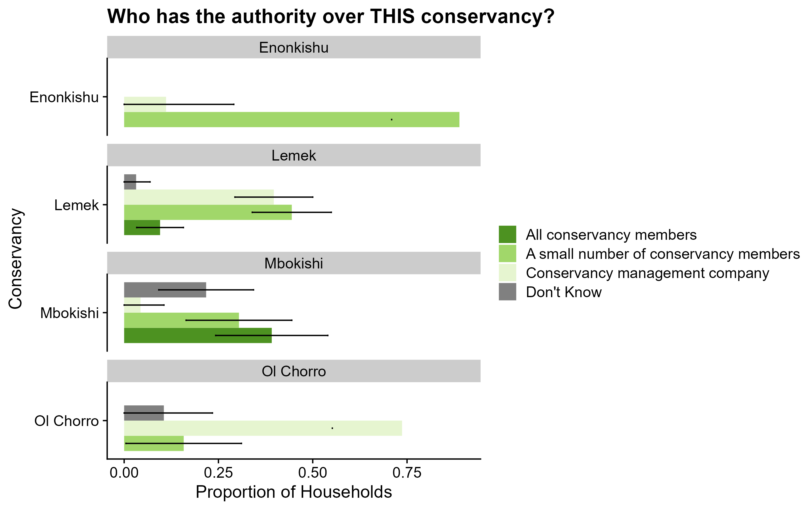
```

---
class: full

```{r echo=FALSE, out.width="60%"}
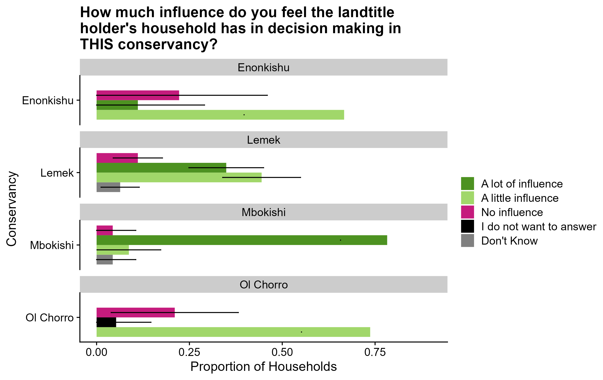
```

---
class: full

```{r echo=FALSE, out.width="70%"}
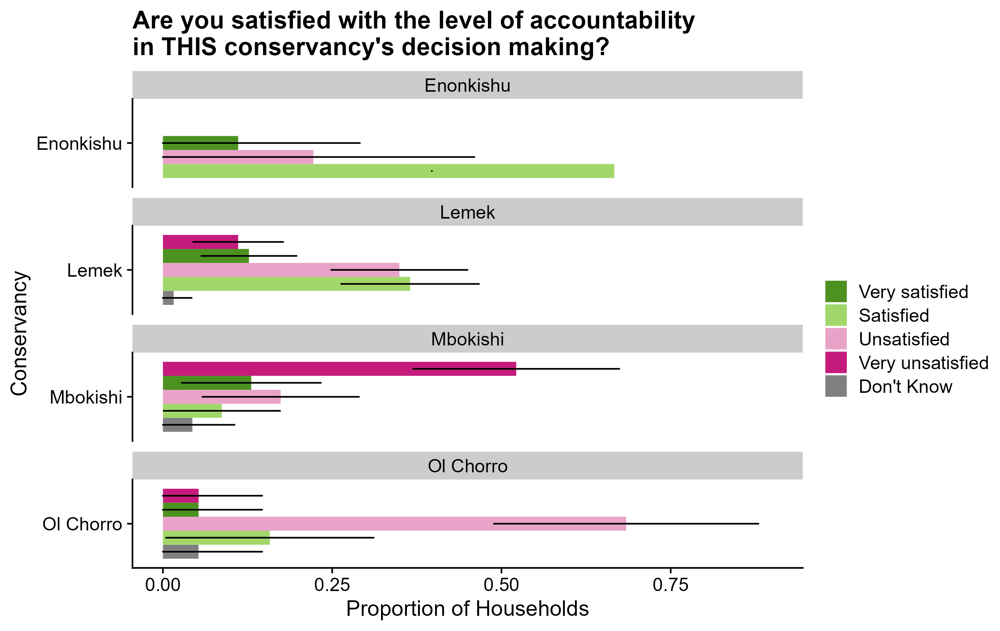
```

---
class: full

```{r echo=FALSE, out.width="70%"}
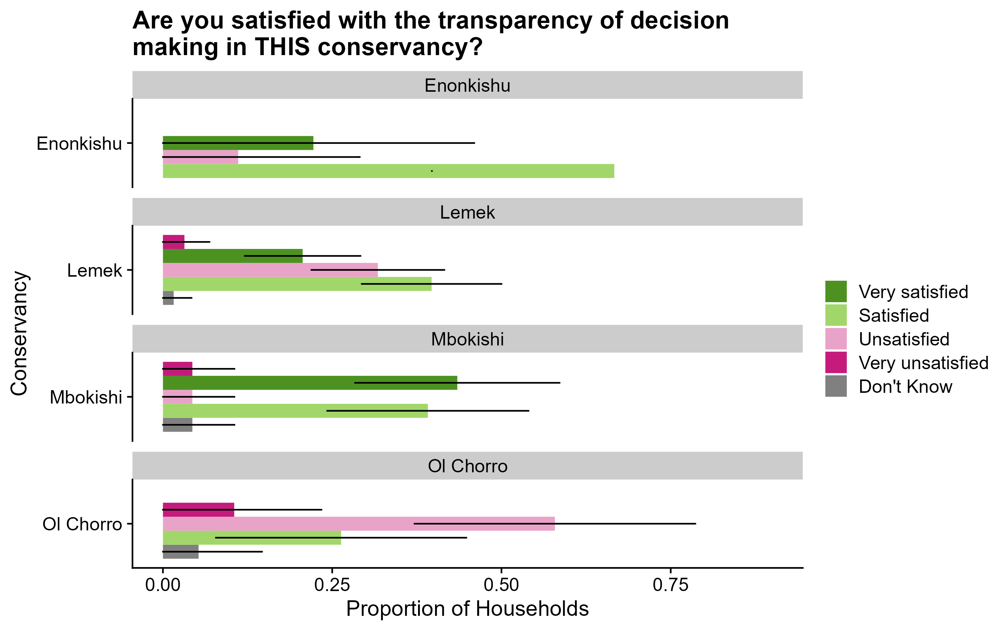
```

---
class: full

```{r echo=FALSE, out.width="60%"}

```

---
class: full

```{r echo=FALSE, out.width="70%"}
knitr::include_graphics("images/women have the power.png")
```

---
class: full

```{r echo=FALSE, out.width="70%"}
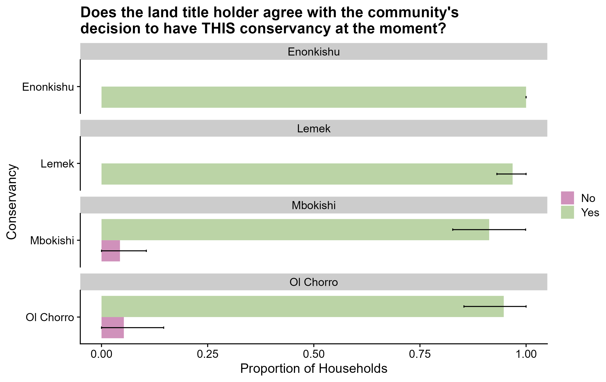
```

---
class: full

```{r echo=FALSE, fig.cap= "At the time that THIS conservancy was set up, did the land title holder personally agree with that decision? Does the land title holder agree with the community's decision to have THIS conservancy at the moment?"}
knitr::include_graphics("images/Sankey agree with cons before after.png")
```

---
# Well-being and Livelihoods

The following slides will look at the land title holders perceptions of their state of well-being in their respective conservancies.

---
class: full

```{r echo=FALSE, out.width="70%"}
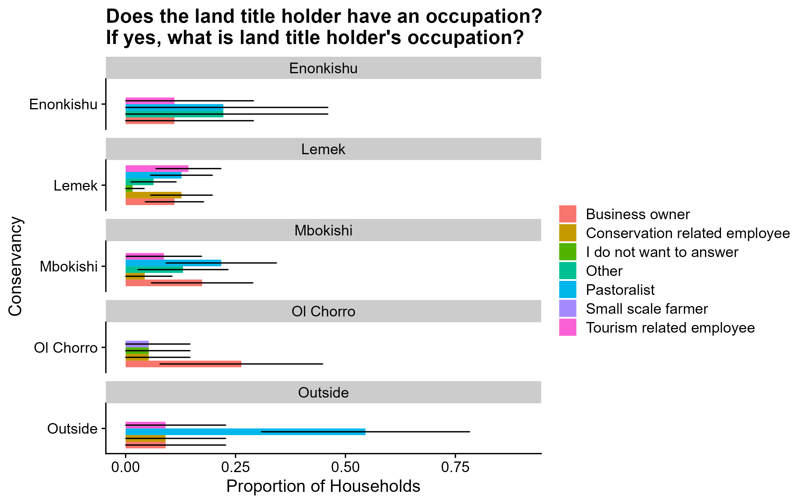
```

---
class: full

```{r echo=FALSE, out.width="60%"}
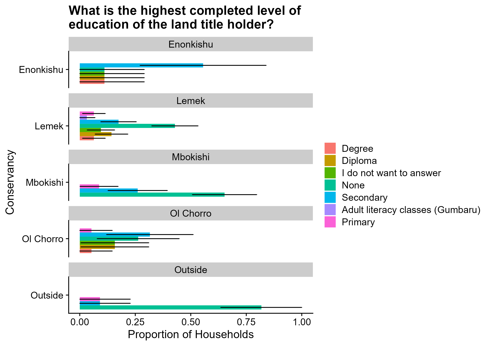
```

---
class: full

```{r echo=FALSE, out.width="60%"}
knitr::include_graphics("images/education access.png")
```

---
class: full

```{r echo=FALSE, out.width="60%"}
knitr::include_graphics("images/access_to_health.png")
```

---
class: full

```{r echo=FALSE, out.width="60%"}
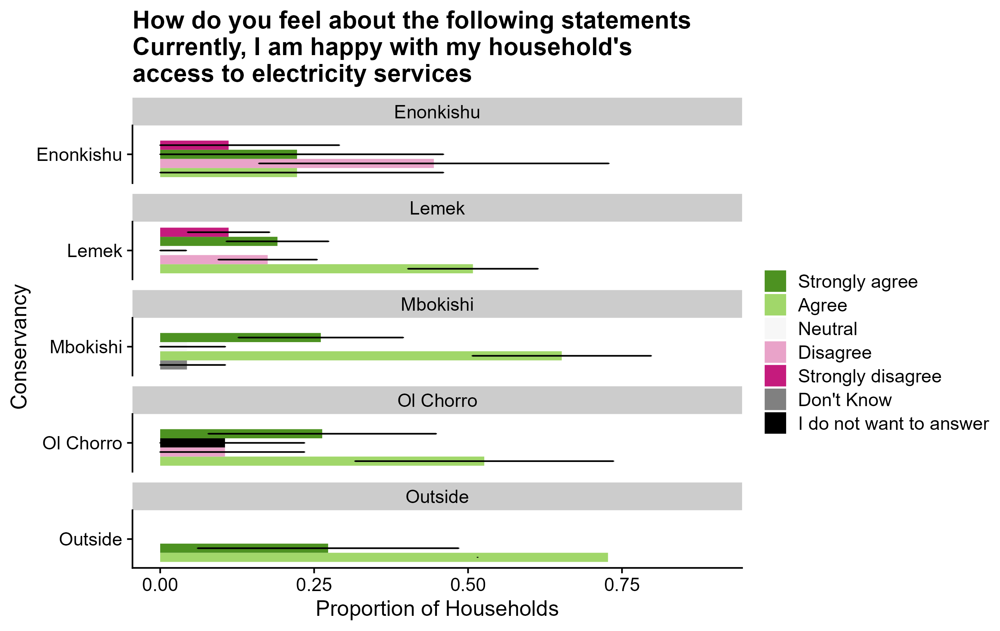
```

---
class: full

```{r echo=FALSE, fig.cap= "Before land access payments were paid by the conservancy, how often did the land title holder's household skip meals due to food shortage? At the moment, how often does the land title holder's household skip meals due to food shortage?"}
knitr::include_graphics("images/skip meals before after.png")
```

---
class: full

```{r echo=FALSE, out.width="60%"}
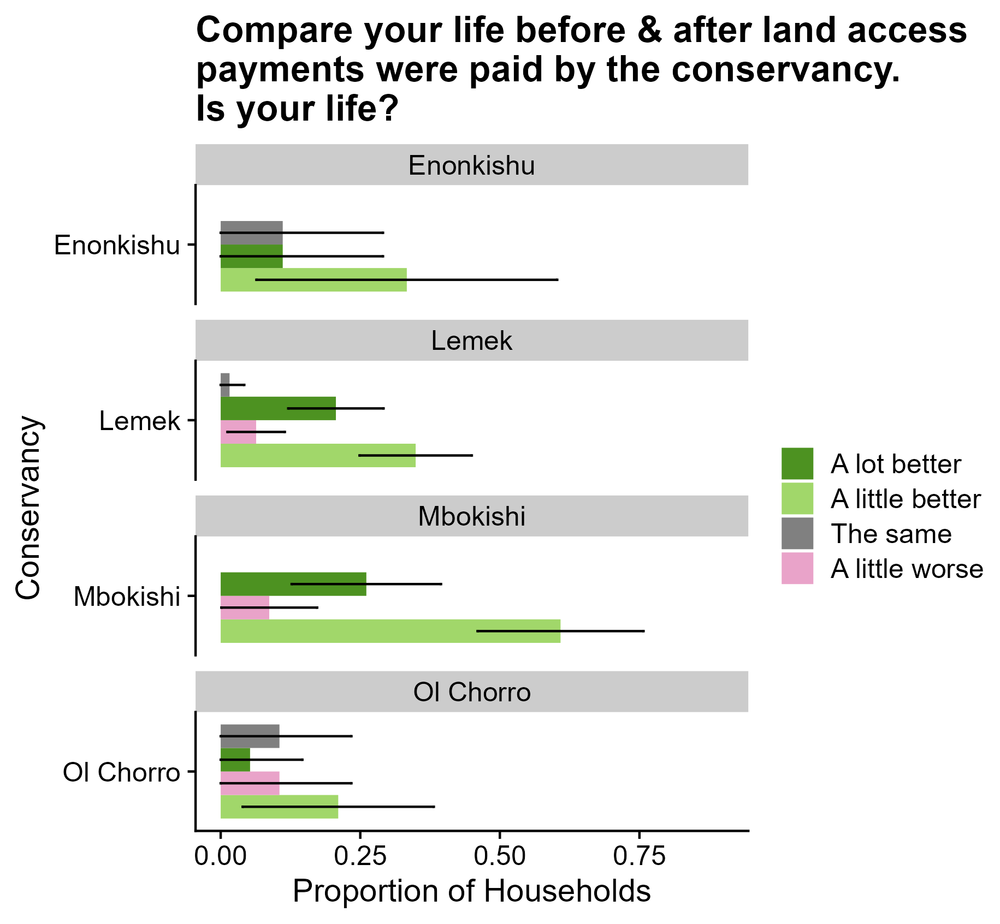
```

---
class: full

```{r echo=FALSE, out.width="60%", out.height= "100%"}
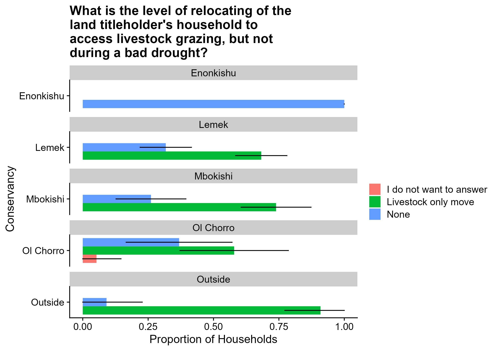
```

---
class: full

```{r echo=FALSE, out.width="70%"}

```

---
class: full

```{r echo=FALSE, out.width="60%"}
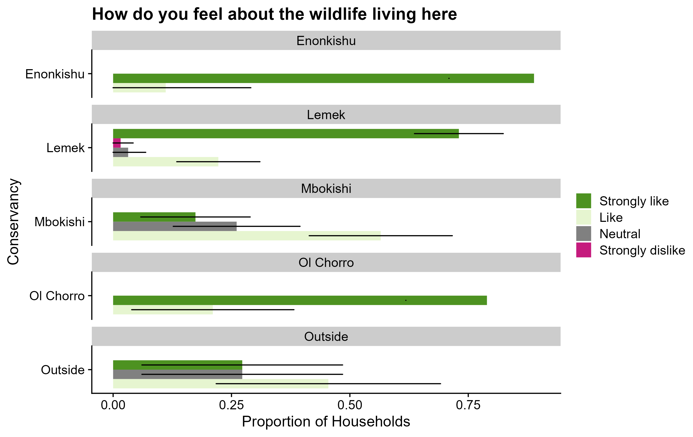
```

---
class: full

```{r echo=FALSE, out.width="70%"}

```